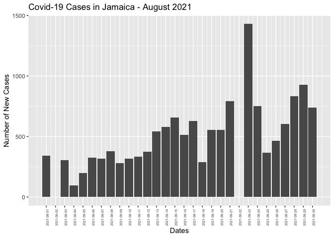

R Notebook
================

Loading packages needed:

``` r
library(tidyverse)
library(ggplot2)
```

Reading in data file and quickly checking it:

``` r
jam_covid<-read.csv("coronavirus_jamaica.csv")
head(jam_covid)
```

    ##     Date Total_Cases New_Cases Total_Deaths New_Deaths Total_Recoveries
    ## 1 8/1/21       53237       342         1196          6            47001
    ## 2 8/2/21       53237         0         1196          0            47001
    ## 3 8/3/21       53543       306         1203          7            47078
    ## 4 8/4/21       53639        96         1207          4            47101
    ## 5 8/5/21       53839       200         1211          4                0
    ## 6 8/6/21       54165       326         1214          3                0
    ##   New_Recoveries Active_Cases
    ## 1             22         5040
    ## 2              0         5040
    ## 3             77         5262
    ## 4             23         5331
    ## 5              0        52628
    ## 6              0        52951

``` r
jam_covid$Date <- as.Date(jam_covid$Date, format="%m/%d/%y")
```

Plot of Daily Covid Case Count in Jamaica: The bar graph below shows the
daily incidence of Covid-19 cases over the month of August 2021. This
dataset was obtained from the Ministry of Health (MOH) monitoring
program.

``` r
covid_plot<-ggplot(data=jam_covid, aes(x = Date, y = New_Cases)) +
  geom_bar(stat = "identity") +
  scale_x_date(breaks = jam_covid$Date) +
  theme(axis.text.x = element_text(angle = 90, size=5)) +
  xlab("Dates") +
  ylab("Number of New Cases") +
  ggtitle("Covid-19 Cases in Jamaica - August 2021")
covid_plot  
```

<!-- -->

This graph shows an alarming trend where daily Covid-19 cases are
increasing quickly over a month period. If this trend continues, then
eventually our healthcare system will overburdened.
