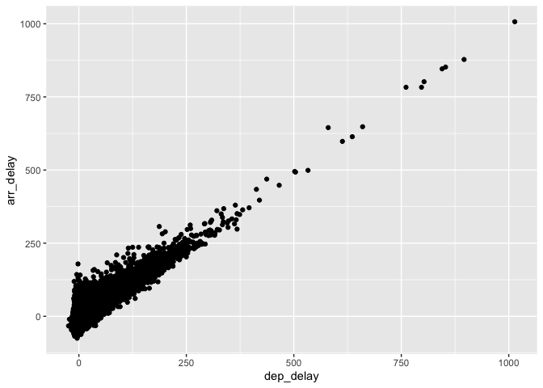

HW 4
================
Zabrenna Griffiths

1.  

``` r
a <-3
b <-2

print(sum(a,b))
```

    ## [1] 5

2.  

``` r
answer <- sum(2,3)
answer
```

    ## [1] 5

3.  

``` r
# loading packages needed
library(nycflights13)
library(tidyverse)
library(ggplot2)
```

``` r
# filtering out flights for American Airlines
AA_flights <- (filter(nycflights13::flights, carrier == "AA"))
```

``` r
# making scatter plot
flight_plot <- ggplot(data=AA_flights, aes(x=dep_delay, y=arr_delay)) +
  geom_point()
flight_plot
```

    ## Warning: Removed 782 rows containing missing values (geom_point).

<!-- -->
