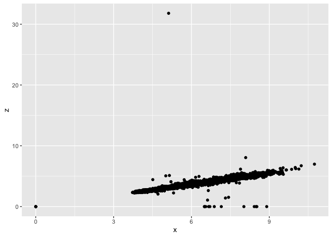
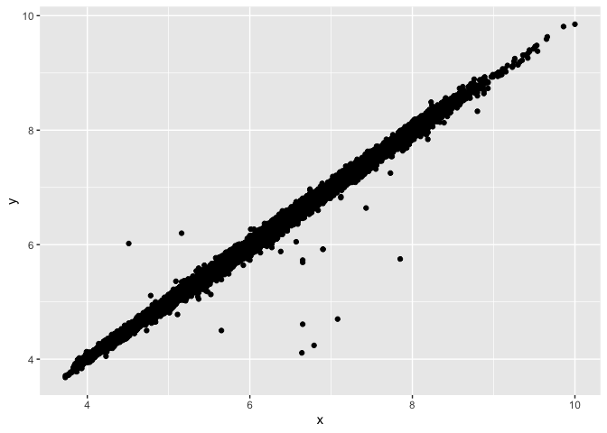
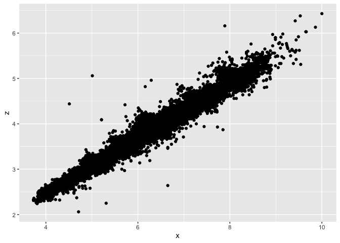

HW 5
================
Zabrenna Griffiths

``` r
# library(diamonds)
library(ggplot2)
library(tidyverse)
library(dplyr)
```

1.  Print a data frame that contains the simple count of diamonds in
    each “cut” (“Fair”, “Good”, etc.).

``` r
diamonds %>% count(cut)
```

    ## # A tibble: 5 × 2
    ##   cut           n
    ##   <ord>     <int>
    ## 1 Fair       1610
    ## 2 Good       4906
    ## 3 Very Good 12082
    ## 4 Premium   13791
    ## 5 Ideal     21551

2.  The diamonds data set is reasonably big, which is a bit of a pain.
    Use dplyr functions to create a that contains 1% of the rows of
    diamonds, randomly sub-setted.

``` r
random_sampling <- sample_frac(diamonds, 0.01)
random_sampling
```

    ## # A tibble: 539 × 10
    ##    carat cut       color clarity depth table price     x     y     z
    ##    <dbl> <ord>     <ord> <ord>   <dbl> <dbl> <int> <dbl> <dbl> <dbl>
    ##  1  0.4  Very Good E     SI2      63.1    57   798  4.72  4.7   2.97
    ##  2  1.21 Premium   D     SI2      62.5    57  6505  6.79  6.71  4.22
    ##  3  1.39 Very Good G     SI2      61.5    62  6628  7.09  7.16  4.38
    ##  4  1.17 Premium   G     VS1      62.4    56  7564  6.81  6.75  4.23
    ##  5  1.3  Premium   I     VS2      62.7    58  6246  6.97  6.9   4.35
    ##  6  0.9  Very Good F     VS2      62.7    58  5160  6.12  6.19  3.86
    ##  7  1    Good      E     SI1      57.2    62  5345  6.59  6.56  3.76
    ##  8  0.7  Premium   F     SI1      61.5    57  2354  5.74  5.68  3.51
    ##  9  2.14 Premium   I     VS2      59.3    59 15418  8.39  8.43  5   
    ## 10  1.21 Good      J     VS2      61      64  5096  6.89  6.79  4.17
    ## # … with 529 more rows

3.  Calculate the average size of the 100 largest diamonds in each
    clarity category.

``` r
top_100 <- diamonds %>% 
  group_by(clarity) %>%
  slice_max(carat, n= 100) %>%
  summarise(mean(carat))
top_100
```

    ## # A tibble: 8 × 2
    ##   clarity `mean(carat)`
    ##   <ord>           <dbl>
    ## 1 I1               2.46
    ## 2 SI2              2.62
    ## 3 SI1              2.29
    ## 4 VS2              2.22
    ## 5 VS1              2.10
    ## 6 VVS2             1.64
    ## 7 VVS1             1.50
    ## 8 IF               1.39

4.  Make two scatter plots:

-   plot of the x dimension vs the y dimension

``` r
ggplot(data=diamonds, aes(x=x, y=y)) +
  geom_point() 
```

<!-- -->

``` r
  # xlim(3,11) +
  # ylim(0,20)
```

-   plot of the x dimension vs the z dimension

``` r
ggplot(data=diamonds, aes(x=x, y=z)) +
  geom_point()
```

<!-- -->

5.  Note that x, y, and z here refer to the length, width, and depth of
    the diamond in mm. Are there any data points that you find
    suspicious? If so: create a new data frame, with these questionable
    points removed.

``` r
diamonds2 <- diamonds %>% 
  filter(x <= 10 & x >3 & y <= 20 & y > 2.5 & z <= 10 & z >2)
```

#### Creating New Plots To Visualize Data After Removing Outliers

``` r
ggplot(data=diamonds2, aes(x=x, y=y)) +
  geom_point()
```

<!-- -->

``` r
ggplot(data=diamonds2, aes(x=x, y=z)) +
  geom_point() 
```

<!-- -->
