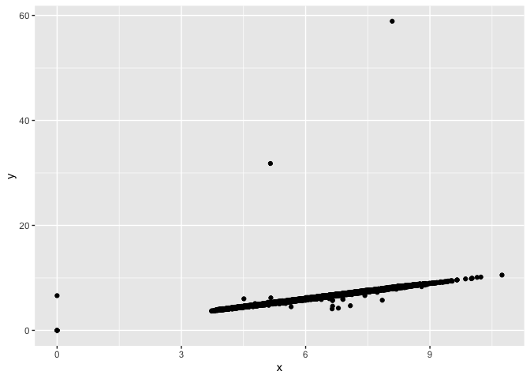

HW 5
================
Zabrenna Griffiths

``` r
#library(diamonds)
library(ggplot2)
library(tidyverse)
```

    ## ── Attaching packages ─────────────────────────────────────── tidyverse 1.3.1 ──

    ## ✓ tibble  3.1.4     ✓ dplyr   1.0.7
    ## ✓ tidyr   1.1.3     ✓ stringr 1.4.0
    ## ✓ readr   2.0.1     ✓ forcats 0.5.1
    ## ✓ purrr   0.3.4

    ## ── Conflicts ────────────────────────────────────────── tidyverse_conflicts() ──
    ## x dplyr::filter() masks stats::filter()
    ## x dplyr::lag()    masks stats::lag()

``` r
library(dplyr)
```

1.  Print a data frame that contains the simple count of diamonds in
    each “cut” (“Fair”, “Good”, etc.).

``` r
diamonds %>% count(cut)
```

    ## # A tibble: 5 × 2
    ##   cut           n
    ##   <ord>     <int>
    ## 1 Fair       1610
    ## 2 Good       4906
    ## 3 Very Good 12082
    ## 4 Premium   13791
    ## 5 Ideal     21551

2.  The diamonds data set is reasonably big, which is a bit of a pain.
    Use dplyr functions to create a that contains 1% of the rows of
    diamonds, randomly sub-setted.

``` r
random_sampling <- sample_frac(diamonds, 0.01)
random_sampling
```

    ## # A tibble: 539 × 10
    ##    carat cut       color clarity depth table price     x     y     z
    ##    <dbl> <ord>     <ord> <ord>   <dbl> <dbl> <int> <dbl> <dbl> <dbl>
    ##  1  0.71 Premium   J     SI2      60.7    59  1609  5.75  5.71  3.48
    ##  2  0.51 Ideal     G     VVS2     61.6    56  1974  5.17  5.12  3.17
    ##  3  0.31 Ideal     F     VS2      62.2    56   583  4.36  4.39  2.72
    ##  4  0.74 Ideal     D     VS2      61.9    56  3087  5.84  5.79  3.6 
    ##  5  0.86 Ideal     E     SI2      60      56  3478  6.22  6.24  3.74
    ##  6  0.33 Ideal     E     VVS2     60      56   970  4.53  4.56  2.72
    ##  7  0.36 Ideal     E     SI1      62.4    55   810  4.58  4.55  2.85
    ##  8  0.82 Fair      F     SI2      56.7    70  2508  6.28  6.16  3.53
    ##  9  0.38 Very Good H     SI1      60.1    57   662  4.73  4.75  2.85
    ## 10  0.7  Good      F     VS1      57.8    61  2751  5.83  5.79  3.36
    ## # … with 529 more rows

3.  Calculate the average size of the 100 largest diamonds in each
    clarity category.

``` r
top_100 <- diamonds %>% 
  group_by(clarity) %>%
  slice_max(carat, n= 100) %>%
  summarise(mean(carat))
top_100
```

    ## # A tibble: 8 × 2
    ##   clarity `mean(carat)`
    ##   <ord>           <dbl>
    ## 1 I1               2.46
    ## 2 SI2              2.62
    ## 3 SI1              2.29
    ## 4 VS2              2.22
    ## 5 VS1              2.10
    ## 6 VVS2             1.64
    ## 7 VVS1             1.50
    ## 8 IF               1.39

4.  Make two scatter plots:

-   plot of the x dimension vs the y dimension

``` r
ggplot(data=diamonds, aes(x=x, y=y)) +
  geom_point() 
```

<!-- -->

``` r
  # xlim(3,11) +
  # ylim(0,20)
```

-   plot of the x dimension vs the z dimension

``` r
ggplot(data=diamonds, aes(x=x, y=z)) +
  geom_point()
```

<!-- -->

5.  Note that x, y, and z here refer to the length, width, and depth of
    the diamond in mm. Are there any data points that you find
    suspicious? If so: create a new data frame, with these questionable
    points removed.

``` r
diamonds2 <- diamonds %>% 
  filter(x <= 10 & x >3 & y <= 20 & y > 2.5 & z <= 10 & z >2)
```

#### Creating New Plots To Visualize Data After Removing Outliers

``` r
ggplot(data=diamonds2, aes(x=x, y=y)) +
  geom_point()
```

<!-- -->

``` r
ggplot(data=diamonds2, aes(x=x, y=z)) +
  geom_point() 
```

<!-- -->
