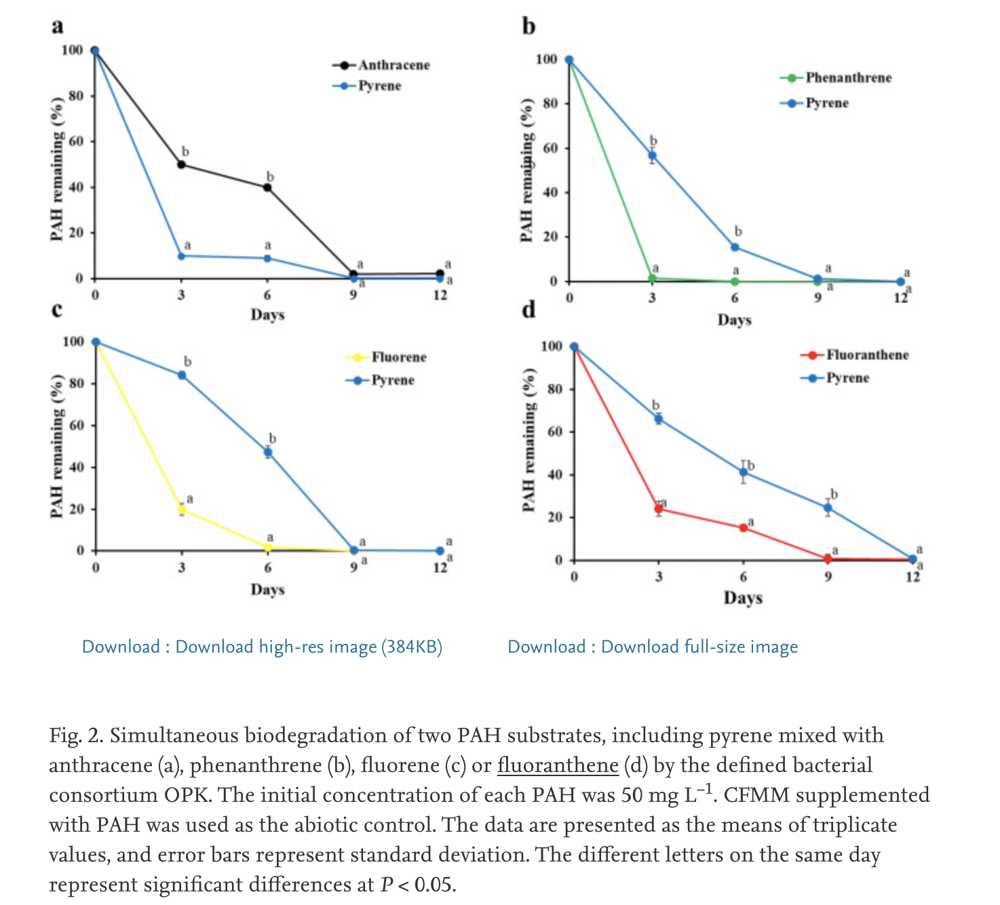
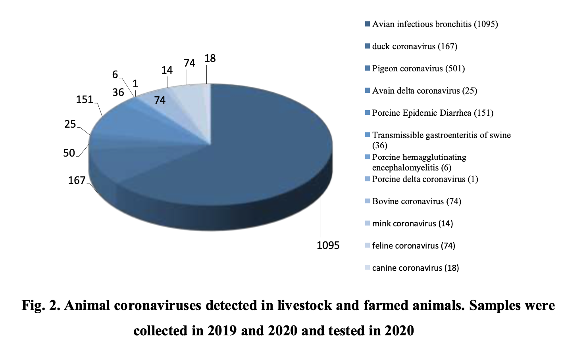

HW 6
================
Zabrenna Griffiths

## Successful plot

 Source: Laothamteep, Natthariga, et
al. “Effects of Environmental Factors and Coexisting Substrates on Pah
Degradation and Transcriptomic Responses of the Defined Bacterial
Consortium Opk.” Environmental Pollution, 2021.

The data named “Days” is mapped to the x axis and is a discrete variable
in this case. The data named “% PAH Remaining” is mapped to the y axis
(different colours represent different PAHs) and is a continuous
variable. The data are displayed using both points (with error bars) and
lines.

## Unsuccesful plot

 Source: World Health Organization.
WHO-convened Global Study of Origins of SARS-CoV-2: China Part, 2021

This is a pie chart so there’s no x variable. The y variable is the
number of samples that tested positive for animal coronaviruses in
livestock (also represented by a colour variation based on coronavirus
type). It is a discrete variable

-   I think this plot is unsuccessful because the colour scheme used
    doesn’t have a distinct variation so it’s difficult to differentiate
    between the different shades of blue. Though the figures along the
    curve are more useful in identifying what coronavirus was present
    than the colour scheme, the large number of categories makes the pie
    chart look clustered.
-   I think this data could have been better represented using a table
    or a bar graph if you wanted some more visual stimulation.
