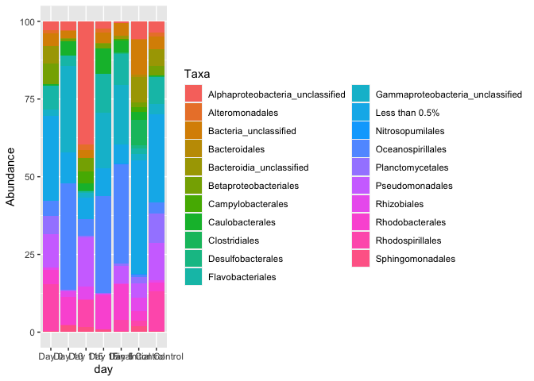
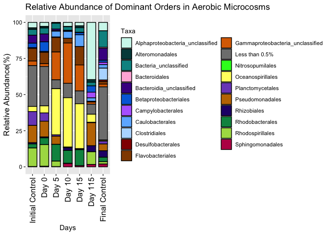

HW 7
================
Zabrenna Griffiths

Loading necessary packages

``` r
library(tidyverse)
```

Loading in data file

``` r
justsamples <- read.csv("samples_taxa.csv", stringsAsFactors= FALSE)
# head(justsamples)
```

Just some data selection to only work with aerobic samples

``` r
aerobicsubset <- justsamples[which(justsamples$oxygen==2),]
# head(aerobicsubset)
```

Making my bad plot showing relative abundances of different bacterial
orders in an aerobic microcosm experiment. However, you would not
immediately know that because there’s no title on this plot (Wilke pg.
22)

``` r
aer_plot <-ggplot(aerobicsubset, aes(x= day, fill = Taxa, y = Abundance))+
  geom_bar(stat= "identity")
aer_plot
```

<!-- -->

This plot is made with the ggplot color default which is super unhelpful
in this case as it uses a continuous color scale. This makes it
difficult to differentiate between bacterial orders for a person with
normal vision. This plot would probably be even more difficult for a
person with color blindness to interpret as the color scale also
includes a lot of close shades of red and green. The data looks like its
intermingling instead of being distinctive (Wilke, 19).  
This plot is also a little messy and needs some revision to portray the
result (Tufte, 105). The x-axis labels are overlapping and difficult to
read. They are also arranged in the default alphabetical order which is
not the best way to arrange this dataset (Wilke, 23). Both Tufte and
Wilke advise against clutter and maximizing the data-ink ratio.

Making a better plot goals:  
\* add title  
\* fix axis angles  
\* change order of labels on x-axis  
\* change colors of bars

``` r
color_scale = c("#d0f7ed","#004949","#009292","#ffb6db","#490092","#006ddb","#b66dff","#6db6ff","#b6dbff",
 "#920000","#924900","#db6d00","gray50","#24ff24","#ffff6d", "#7B4EC2", "#C17600", "#250977", "#00914F", "#AADA52", "#BB0054", "#FCCD83", "#5B1549", "#E2D84F", "#5B005B", "#BDDF8E", "#5A0811", "#007AE8", "#425800", "#FF69C5", "#730006", "#C7E9B4", "#762A83", "#FFF7BC", "#D9D9D9", "#000000", "#F16913", "#003C30", "#FFF7FB", "#8C6BB1", "#FD8D3C", "#F7F7F7", "#EF3B2C")
```

``` r
orderedsubset <- aerobicsubset %>%
arrange_at("Taxa", desc) %>%
  arrange_at("Abundance")
```

``` r
aer_plot_new <-ggplot(orderedsubset, aes(x= day, fill = Taxa, y = Abundance)) +
  geom_bar(stat= "identity", colour="black", width = 0.75) +
  theme(axis.text.x = element_text(angle = 90, size = 12, colour = "black", vjust = 0.5, hjust = 1), 
        axis.title.y = element_text(size = 12), legend.title = element_text(size = 10), 
        legend.text = element_text(colour = "black", size = 8.5), 
        axis.text.y = element_text(colour = "black")) +
  ggtitle("Relative Abundance of Dominant Orders in Aerobic Microcosms") +
  labs(y= "Relative Abundance(%)", x = "Days") +
  scale_fill_manual(values = color_scale) +
  scale_x_discrete(limits = c("Initial Control", "Day 0", "Day 5", "Day 10", "Day 15", "Day 115", "Final Control"))
aer_plot_new
```

<!-- -->

My “good” plot could still use some work to increase the plot size.
