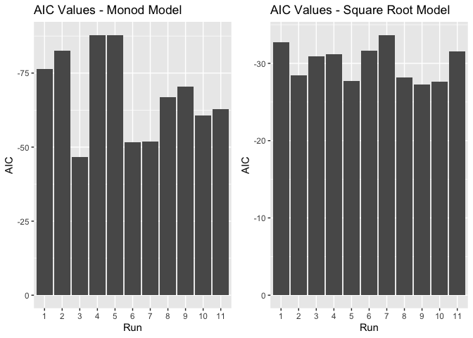

HW 8
================
Zabrenna Griffiths

# Question 1

Using the diamonds data set, make a data frame that shows the slope of
the relationship of price as a function of weight (carat) for each
unique color, in decreasing order of slope

How does price change for with weight/carat for each diamond color?

``` r
library(tidyverse)
library(modelr)
library(purrr)
```

``` r
by_color <- diamonds %>% 
  group_by(color) %>% 
  nest()

# Function to create a linear model of price as a function of weight (carat) 
price_for_carat <- function(df) {
  m<- lm(price ~ carat, data = df)
  m
}
# summary(price_for_carat)

# Applying function to by color database 
by_color <- by_color %>% 
  mutate(fit = map(data, price_for_carat))

# Making function to extract slope
getslope <- function(fit_obj) {
  slope <- coef(fit_obj)[2]
  slope
}

# Applying this to dataframe
by_color <- by_color %>% 
  mutate(slope = map_dbl(fit, getslope))

fit <- unnest(by_color, data)
head(fit)
```

    ## # A tibble: 6 × 12
    ## # Groups:   color [1]
    ##   color carat cut     clarity depth table price     x     y     z fit    slope
    ##   <ord> <dbl> <ord>   <ord>   <dbl> <dbl> <int> <dbl> <dbl> <dbl> <list> <dbl>
    ## 1 E      0.23 Ideal   SI2      61.5    55   326  3.95  3.98  2.43 <lm>   8296.
    ## 2 E      0.21 Premium SI1      59.8    61   326  3.89  3.84  2.31 <lm>   8296.
    ## 3 E      0.23 Good    VS1      56.9    65   327  4.05  4.07  2.31 <lm>   8296.
    ## 4 E      0.22 Fair    VS2      65.1    61   337  3.87  3.78  2.49 <lm>   8296.
    ## 5 E      0.2  Premium SI2      60.2    62   345  3.79  3.75  2.27 <lm>   8296.
    ## 6 E      0.32 Premium I1       60.9    58   345  4.38  4.42  2.68 <lm>   8296.

``` r
# Plot predictions vs carat for each color
ggplot(fit, aes(x=carat, y=price)) +
  geom_point() +
  geom_smooth(method = "lm", se = FALSE) +
  facet_wrap(~color)
```

<!-- -->

# Question 2

The DNase dataset in the datasets package (which automatically loads
when you load R) has examples of ELISA band optical density as a
function of protein concentration, for 12 different runs. These
relationships are clearly nonlinear (please plot density as a function
of conc to see for yourself!).

``` r
library(nls2)
```

    ## Loading required package: proto

``` r
DNase %>%
  ggplot(aes(conc, density)) + geom_point()
```

<!-- -->

Non-linear Least Squares Model:

``` r
nls_mod <- formula(density ~ beta_1 * sqrt(conc) + beta_0)

single_sqrt_model <- function(DNase) {
  nls2(nls_mod, 
  data = DNase, 
  start = list(beta_1 = 0.53, beta_0 = 0.19))
}
```

Monod Model:

``` r
monod_eq <- formula(density ~ (conc * dmax) / (conc + k))

monod_model <-  function(DNase) {
  nls2(monod_eq, 
  data = DNase, 
  start = list(dmax = 0.09, k = 1.12))
}
```

Your assignment is to use list-columns to create a separate square root
model and monod model for density as a function of concentration, for
each Run

``` r
# Sorting out by run and making nested df
by_run <- DNase %>% 
  group_by(Run) %>% 
  nest()
```

``` r
# Applying Square Root Model to df
ssrt <-  by_run %>% 
  mutate(model = map(data, single_sqrt_model))
                     
glance_ssrt <- ssrt %>% 
  mutate(glance = map(model, broom::glance)) %>% 
  unnest(glance)

glance_ssrt %>%
  group_by(Run) %>%
  arrange(AIC) %>%
  head()
```

    ## # A tibble: 6 × 12
    ## # Groups:   Run [6]
    ##   Run   data              model   sigma isConv  finTol logLik   AIC   BIC deviance
    ##   <ord> <list>            <list>  <dbl> <lgl>    <dbl>  <dbl> <dbl> <dbl>    <dbl>
    ## 1 7     <tibble [16 × 2]> <nls>  0.0748 TRUE   2.21e-7   19.8 -33.7 -31.4   0.0784
    ## 2 1     <tibble [16 × 2]> <nls>  0.0771 TRUE   2.35e-8   19.4 -32.7 -30.4   0.0833
    ## 3 6     <tibble [16 × 2]> <nls>  0.0798 TRUE   2.88e-8   18.8 -31.6 -29.3   0.0891
    ## 4 11    <tibble [16 × 2]> <nls>  0.0799 TRUE   5.40e-8   18.8 -31.6 -29.3   0.0895
    ## 5 4     <tibble [16 × 2]> <nls>  0.0809 TRUE   2.17e-8   18.6 -31.2 -28.9   0.0915
    ## 6 3     <tibble [16 × 2]> <nls>  0.0817 TRUE   2.45e-8   18.4 -30.9 -28.6   0.0935
    ## # … with 2 more variables: df.residual <int>, nobs <int>

``` r
# Applying Monod Model to df
mnd <-  by_run %>% 
  mutate(model = map(data, monod_model))
                     
glance_mnd <- mnd %>% 
  mutate(glance = map(model, broom::glance)) %>% 
  unnest(glance)

glance_mnd %>%
  group_by(Run) %>%
  arrange(AIC) %>%
  head()
```

    ## # A tibble: 6 × 12
    ## # Groups:   Run [6]
    ##   Run   data              model   sigma isConv  finTol logLik   AIC   BIC deviance
    ##   <ord> <list>            <list>  <dbl> <lgl>    <dbl>  <dbl> <dbl> <dbl>    <dbl>
    ## 1 4     <tibble [16 × 2]> <nls>  0.0138 TRUE   2.54e-7   46.9 -87.9 -85.6  0.00265
    ## 2 5     <tibble [16 × 2]> <nls>  0.0138 TRUE   4.74e-8   46.9 -87.9 -85.6  0.00265
    ## 3 2     <tibble [16 × 2]> <nls>  0.0162 TRUE   2.22e-7   44.3 -82.6 -80.3  0.00369
    ## 4 1     <tibble [16 × 2]> <nls>  0.0197 TRUE   2.48e-6   41.2 -76.4 -74.1  0.00542
    ## 5 9     <tibble [16 × 2]> <nls>  0.0238 TRUE   8.06e-7   38.2 -70.3 -68.0  0.00794
    ## 6 8     <tibble [16 × 2]> <nls>  0.0266 TRUE   3.54e-6   36.4 -66.8 -64.5  0.00988
    ## # … with 2 more variables: df.residual <int>, nobs <int>

The Monod model has lower AIC values than the Square-root model.
Therefore, the Monod model is a better fit to the data.

``` r
library(cowplot)

p1 <- ggplot(glance_mnd, aes(x = Run, y = AIC)) +
  geom_col() +
  scale_y_reverse() +
  scale_x_discrete(limits=c("1", "2", "3", "4", "5", "6", "7", "8", "9", "10", "11")) + 
  ggtitle("AIC Values - Monod Model")

p2 <- ggplot(glance_ssrt, aes(x = Run, y = AIC)) +
  geom_col() +
  scale_y_reverse() +
  scale_x_discrete(limits=c("1", "2", "3", "4", "5", "6", "7", "8", "9", "10", "11")) + 
  ggtitle("AIC Values - Square Root Model")

plot_grid(p1, p2)
```

<!-- -->
